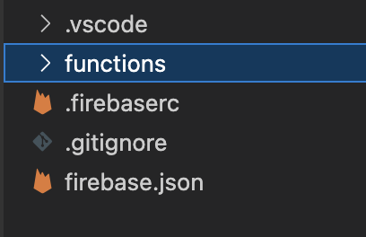
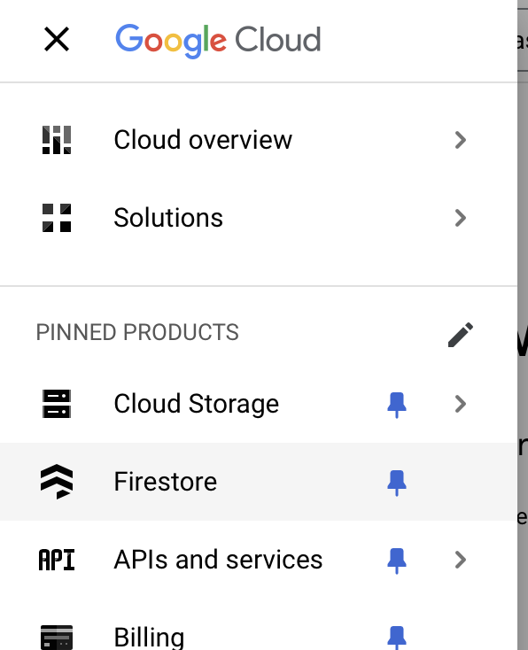
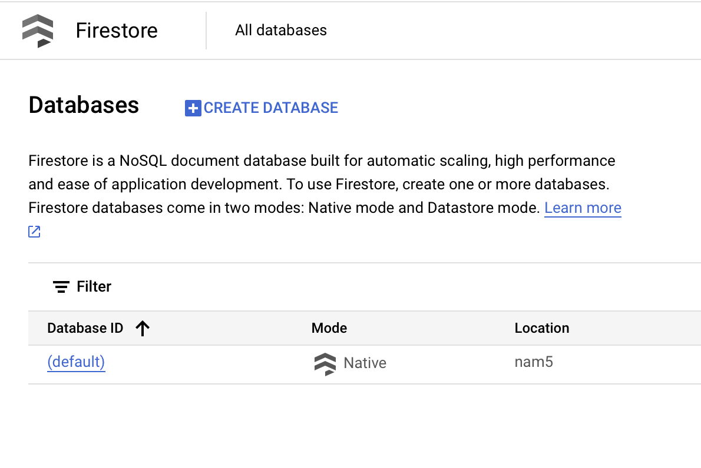
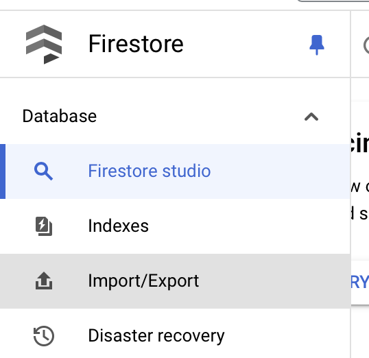
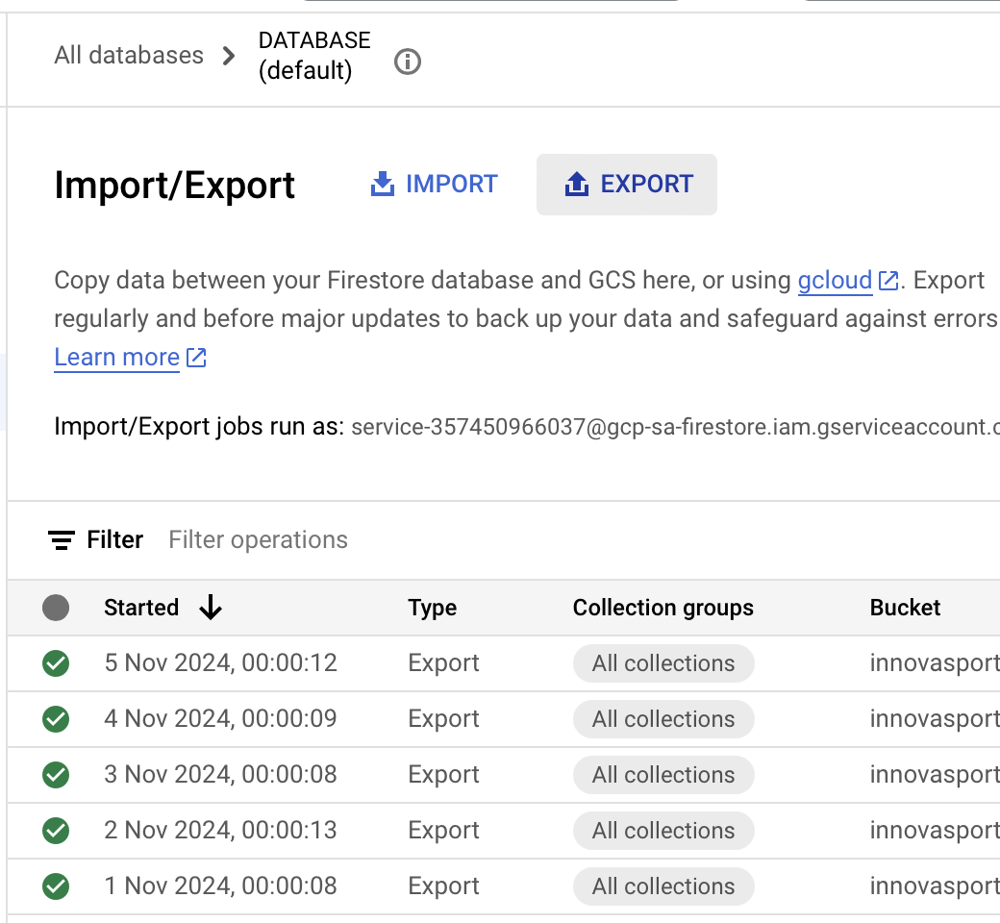
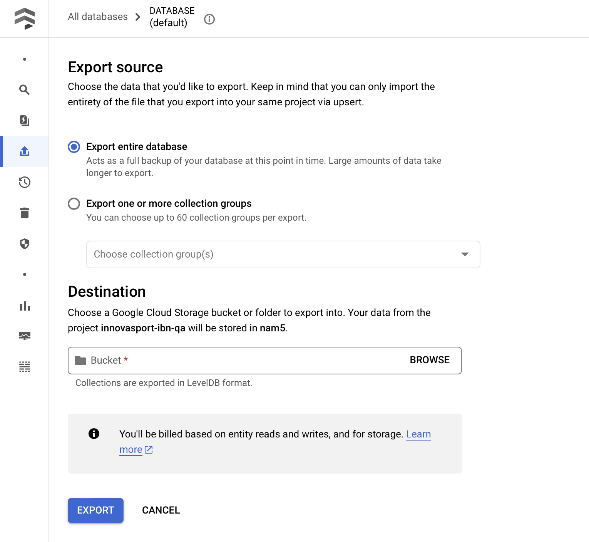
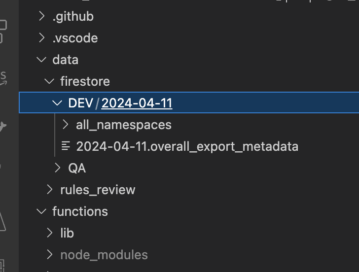

# Firebase Emulator Suite

> https://firebase.google.com/docs/emulator-suite

Para tener una buena práctica de "no probar en producción" podemos usar los emuladores de los servicios de Firebase, lo cual replica el funcionamiento de la base de datos, cloud functions, storage y otros servicios en un entorno local, lo cual podría evitarnos el problema de hacer deploy de código defectuoso.

La configuración de los emuladores se pone en el archivo `firebase.json` del proyecto, el cual puede indicar rutas a archivos que especifican las reglas de seguridad y los índices (en el caso de firestore)

```json
{
    // Reglas para RTDB
    "database": {
        "rules": "database.rules.json"
    },
    // Reglas para Firestore
    "firestore": {
        "rules": "firestore.rules",
        "indexes": "firestore.indexes.json"
    },
    // Reglas para storage
    "storage": {
        "rules": "storage.rules"
    },
    ...,
    "emulators": {
        "pubsub": {
            "port": 8085
        },
        "functions": {
            "port": 5001
        },
        "firestore": {
            "port": 8080
        },
        "database": {
            "port": 9000
        },
        "storage": {
            "port": 9199
        },
        "ui": {
            "enabled": true
        },
        "hosting": {
            "port": 5000
        },
        "singleProjectMode": true,
    }
}
```

Ejemplos de los archivos

- [database.rules.json](./docs/database.rules.json)
- [firestore.rules](./docs/firestore.rules)
- [firestore.indexes.json](./docs/firestore.indexes.json)
- [storage.rules.json](./docs/storage.rules)

Los archivos de indexes podemos obtenerlos mediante CLI, de manera similar en la que podemos hacer deploy

Ejemplo, en un escenario donde queremos pasar los indexes del ambiente dev al ambiente qa
```ps1
# descargar indexes en archivo local
firebase use dev
firebase firestore:indexes > firestore.indexes.json

# publicar indexes a partir de archivo local
firebase use qa
firebase deploy --only firestore:indexes
```

Los archivos de las rules podemos copiarlos desde la Firebase Console (web) o hacer un script con el sdk de admin que los descargue

```ts
// Descargar reglas
const from_app = admin.initializeApp({
    credential: admin.credential.cert(service_account_from as admin.ServiceAccount),
    databaseURL: from_db_default,
    storageBucket: from_sg
}, 'from');
const from_rules = from_app.securityRules();
const fs_ruleset = await from_rules.getFirestoreRuleset();

// Subir reglas
const to_app = admin.initializeApp({
    credential: admin.credential.cert(service_account_to as admin.ServiceAccount),
    databaseURL: to_db_default,
    storageBucket: to_sg
}, 'to');
const to_rules = to_app.securityRules();
await to_rules.releaseFirestoreRulesetFromSource(fs_ruleset.source[0].content);
```

Una vez tengamos esta configuración, podemos usar el comando `firebase emulators:start`

> Flag `--only` Optional. Limit which emulators start. Supply a comma-separated list of emulator names, specifying one or more of 'auth', 'database', 'firestore', 'functions', 'hosting', or 'pubsub'. `firebase emulators:start --only functions,firestore`

> Flag `--import=import_directory` Optional. Use with the Authentication, Cloud Firestore, Realtime Database or Cloud Storage for Firebase emulator.

## Debugging
No es tanto de Firebase, sino de VSCode
### Cloud Functions
En un repositorio donde iniciamos el proyecto de funciones directamente en root, tendríamos VSCode abierto y nuestro workspace se vería algo así


Tenemos que crear un archivo `.vscode/launch.json` con la siguiente configuración

```json
{
    "configurations": [
        {
            "type": "node",
            "request": "attach",
            "name": "FB Functions",
            "port": 9229
        },
    ]
}
```

Luego, en el archivo `functions/package.json` debemos tener dos scripts

```json
{
    ...
    "scripts"{
        ...,
        "watch": "tsc --watch",
        "debug": "firebase emulators:start --inspect-functions",
    }
    ...
}
```

Con eso es suficiente para poder hacer debugging de un proyecto de functions, para poner breakpoints y ver lo que se va ejecutando paso a paso.

#### Debugging con data importada
Para esto, necesitamos obtener la data... eso se puede hacer del firestore en GCP, se genera un export de la base de datos hacia un bucket de storage y lo tenemos que descargar.

##### Export de firestore






##### Descarga de un export de firestore
Se necesita tener instaladas las herramientas de CLI de gcloud

```ps1
gsutil -m cp -r "gs://bucket-name/path" local_path
```

ejemplo real
```ps1
gsutil -m cp -r "gs://innovasport-ibn-qa-firestore-backups/2024-10-06T06:00:15_18770" .
```

##### Importar la data para debugging
Para esto, agregaremos un flag al script de debug, y recomiendo hacerlo en un script aparte como `debugDev` o similar

```json
{
    ...
    "scripts": {
        ...,
        "debugDev": "firebase emulators:start --inspect-functions --import ../data/firestore/DEV/2024-04-11",
    }
}
```

donde `../data/firestore/DEV/2024-04-11` es la ruta a lo que descargamos en la sección [descarga de un export de firestore](#descarga-de-un-export-de-firestore)

